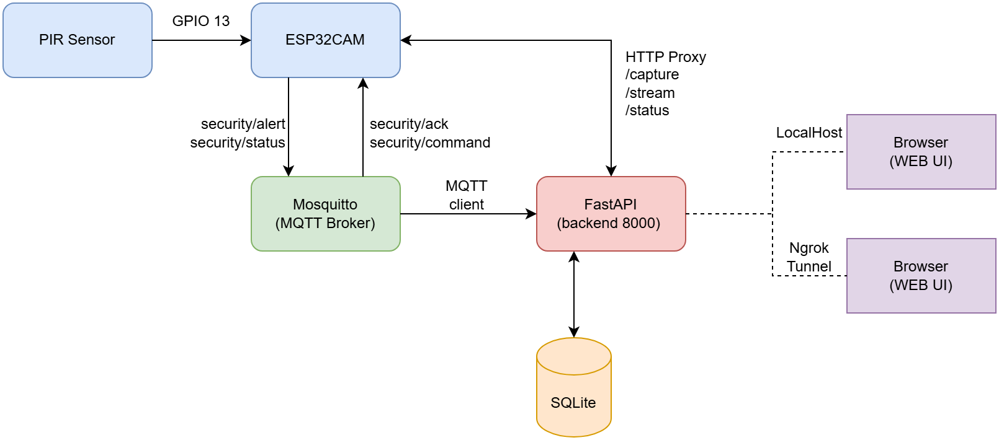

# Hybrid IoT Security System

MQTT-controlled ESP32-CAM with web-based monitoring and PIR triggering.

## What it is

A security camera node that wakes on motion, publishes an MQTT alert, and
serves the captured JPEG over HTTP. The FastAPI backend bridges the MQTT
stream to the browser via WebSocket **and** reverse-proxies the ESP32's
HTTP endpoints, so the dashboard only ever talks to the backend. Because
every transport collapses onto a single origin (`:8000`), exposing the
dashboard publicly via `ngrok http 8000` covers WebSocket + REST + camera
frames in one tunnel while the ESP32 stays on the LAN.

### Why "hybrid"

The design deliberately uses **two wireless protocols in one system**,
plus a hardware-interrupt event source:

- **MQTT** (TCP 1883 / WS 9001) — small, latency-sensitive signalling:
  motion alerts, commands, acks, status heartbeats. Broker never touches
  binary payloads.
- **HTTP** (ESP32 :80 served internally, backend :8000 served to the
  browser) — high-bandwidth image frames. The backend reverse-proxies
  `/capture`, `/stream`, `/status` under `/api/*`, so the ESP32's LAN IP
  never reaches the browser and a single public URL covers everything.
- **GPIO 13 interrupt** — HC-SR501 PIR is the only event source, and the
  same pin is the `ext0` deep-sleep wakeup, so the device can spend most
  of its life asleep and only spin up when something actually moves.

---

## Architecture

### System context



**Who talks to whom, in one read:**

| From → To | Transport | Port | Carries |
| --- | --- | --- | --- |
| PIR → ESP32 | GPIO rising edge (hardware) | GPIO 13 | Single motion pulse — also `ext0` wake |
| ESP32 ↔ Broker | MQTT | 1883 | `security/alert` · `status` (retained + LWT) · `command` · `ack` |
| Broker ↔ Backend | MQTT (aiomqtt subscriber) | 1883 | Same four topics, fanned out + logged |
| Backend → ESP32 | HTTP (reverse proxy) | 80 | `/capture` · `/stream` · `/status` on demand |
| Backend ↔ Browser | WebSocket `/ws` | 8000 | Every MQTT message, fanned out |
| Browser → Backend | HTTP REST | 8000 | `/api/command` · `/api/ack` · `/api/capture` · `/api/stream` · `/api/events` · `/api/health` |
| Remote viewer → ngrok → Backend | HTTPS tunnel | 443 → 8000 | Same as local browser; nothing else is exposed |

**Key invariants:**

- The browser (and therefore the ngrok URL) **never** sees the ESP32's
  LAN IP, the broker address, or port 1883. Only `/api/*` exists outward.
- **MQTT** stays on the LAN end-to-end. The broker port is deliberately
  **not** tunnelled.
- **HTTP** image frames always go `ESP32 -> backend -> browser`, never
  `ESP32 -> browser` directly.
- **GPIO 13** is the only event source. Everything downstream is
  reactive; nothing polls the PIR.


### Component map

| Component | Code location | Language / stack | Role in the flow above |
| --- | --- | --- | --- |
| **PIR sensor** | hardware | — | Emits the only event trigger (GPIO 13 rising edge; also `ext0` wakeup) |
| **Firmware** | `src/firmware/firmware.ino` | C++ (Arduino, ESP32 core 3.x), `PubSubClient`, `esp_camera`, `esp_http_server`, `esp_sleep` | MQTT client **and** LAN-only HTTP server. Runs FW-PIR / FW-CAM / FW-MQTT / FW-HTTP / FW-PWR submodules |
| **Broker** | `src/broker/mosquitto.conf` | Mosquitto 2.x | Routes MQTT between ESP32 and backend; retained `security/status` + LWT. LAN-only, never tunnelled |
| **Backend** | `src/web/app.py` | Python (FastAPI + aiomqtt + httpx + SQLite) | MQTT ↔ WebSocket bridge, REST for commands/acks, **reverse-proxy** for the ESP32's `/capture` · `/stream` · `/status`, event log persistence |
| **Frontend** | `src/web/static/` | HTML + vanilla JS + Tailwind CSS (Play CDN) + Inter, flat-2.0 with light/dark toggle | Renders alerts, fetches JPEGs via `/api/capture` and `/api/stream` (backend proxy — the LAN IP is never in the DOM), issues commands via `/api/command` |
| **ngrok agent** | run externally (`ngrok http 8000`) | ngrok tunnel | Optional — publishes only the backend's `:8000`. Nothing else (broker, ESP32) is reachable from the public URL |

---

## Prerequisites

| Tool            | Tested version | Notes                                                  |
| --------------- | -------------- | ------------------------------------------------------ |
| Windows         | 11             | All helper scripts are `.bat` (cmd)                    |
| Mosquitto       | 2.x            | `C:\Program Files (x86)\Mosquitto\` on this machine    |
| Python          | 3.10+          | `python --version` must return 3.10 or newer           |
| Arduino IDE     | 2.x            | With ESP32 core 3.x by Espressif                       |
| Arduino library | PubSubClient   | Install via Library Manager, author: Nick O'Leary      |

Hardware: AI-Thinker ESP32-CAM, HC-SR501 PIR, FTDI USB-to-TTL, dupont wires,
and a 2.4 GHz Wi-Fi network the ESP32 can join.

---

## Setup — first time

### 1. Broker (Mosquitto)

```bat
cd broker
REM Make sure the Windows service isn't already holding port 1883:
net stop mosquitto     REM (from an Administrator shell)

run_broker.bat
```

Expected: `Opening ipv4 listen socket on port 1883` and `... port 9001`.

Add a firewall inbound rule so the ESP32 can reach the broker across the
LAN — from an **Administrator** PowerShell:

```powershell
New-NetFirewallRule -DisplayName "Mosquitto MQTT 1883" -Direction Inbound -Protocol TCP -LocalPort 1883 -Action Allow
```

Smoke test (leave broker running, open two more terminals):

```bat
broker\test_broker.bat        REM subscriber on security/#
broker\pub_test_alert.bat     REM publisher — you should see the alert land
```

See `broker/README.md` for details.

### 2. Backend (FastAPI)

```bat
cd web
setup.bat          REM creates .venv and installs requirements
run.bat            REM starts uvicorn on http://0.0.0.0:8000
```

Expected log: `[MQTT] connected to 127.0.0.1:1883`. Visit
<http://127.0.0.1:8000/api/health> → `{"ok":true,"mqtt_connected":true,...}`.

See `web/README.md` for endpoint reference.

### 3. Dashboard (already served by the backend)

Open <http://127.0.0.1:8000/> — the dashboard. You should see:

- Header: **Dashboard / Clips** nav links on the left (active page blue,
  inactive outlined), **PIR: ON / OFF** pill + connection dots + theme
  toggle on the right.
- Two green status dots (**WebSocket** + **Broker**).
- An empty alert panel, a placeholder camera frame with a "Stream is off.
  Press Start stream to connect." message, an empty device status, and the
  event log table (whatever test events you already published). Last alert
  and Device Status get **re-hydrated** from SQLite on every page load, so
  after a navigation round-trip (Dashboard → Clips → Dashboard) those
  panels aren't wiped clean — the latest saved values come back.
- Camera panel: a single **Start stream / Stop stream** toggle (no mode
  dropdown). Stream is off by default; clicking Start opens
  `/api/stream` and shows a **Save stream** button. The ESP32 host is
  never asked for in the UI — it stays on the backend, so the public
  URL (ngrok) never reveals the LAN IP.
- **Device Status** colors the values it shows: `online` = green,
  `offline`/`sleeping` = red. RSSI ≥ -60 dBm green, -60…-75 amber,
  < -75 red.
- **Camera & Clip Settings** form (Resolution / Quality / Duration / FPS)
  is under the camera controls. Resolution and quality are forwarded to
  the firmware over MQTT on Apply — both the live stream and PIR clips
  use the new values. Duration and FPS only affect clip recording.
- A **Light / Dark** toggle in the top-right. Preference is persisted in
  `localStorage` under `sec.theme`; the first visit picks up the OS-level
  `prefers-color-scheme`. Styling is Tailwind (loaded from the CDN), Inter
  from Google Fonts, flat-2.0 look with `rounded-2xl` panels.
- Session state (streaming, saving, PIR armed, clips filter) is persisted
  in `sessionStorage` so navigating between the two pages in the same tab
  doesn't reset anything.

### 4. Firmware

```
cd firmware
copy secrets.h.example secrets.h
```

Edit `secrets.h`:

```cpp
#define WIFI_SSID      "your-ssid"
#define WIFI_PASSWORD  "your-password"
#define MQTT_HOST      "192.168.1.100"   // your PC's LAN IP, not 127.0.0.1
#define MQTT_PORT      1883
```

Find the PC's IP with `ipconfig` → the "IPv4 Address" of the Wi-Fi adapter
on the same network the ESP32 will join.

In Arduino IDE:
- Board: **AI Thinker ESP32-CAM**
- Partition: **Huge APP (3MB No OTA / 1MB SPIFFS)**
- Upload speed: **460800**
- Port: the FTDI COM

Wire the FTDI (`5V→5V`, `GND→GND`, `TX→U0R`, `RX→U0T`), jumper `IO0→GND`,
press RESET, upload. Remove the jumper + RESET again to run.

Open the Serial Monitor at **115200 baud**; expected lines:

```
[BOOT] count=1 wake_reason=0 always_on=1
[CAM] PSRAM found
[CAM] initialized
[WiFi] connected: 10.x.y.z  RSSI -XX dBm
[HTTP] listening on http://10.x.y.z/
[MQTT] connecting to 10.160.155.142:1883 ... ok
```

See `firmware/README.md` for full Arduino IDE + board settings.

### 5. Tell the backend which ESP32 to proxy

**Auto-discovery is the default.** The firmware publishes its LAN IP in
the retained `security/status` payload (every ~30 s heartbeat, plus once
on every Wi-Fi (re)connect). The backend parses that payload and sets its
in-memory `esp32_host` automatically. Because the status topic is
retained, a fresh backend subscription immediately receives the last
known IP without waiting for the next heartbeat — so after a backend
restart the camera usually comes back with zero manual steps.

**Manual fallback** — if you're running pre-auto-discovery firmware, if
the retained status was cleared, or if you just want to override, push
the IP explicitly:

```bat
curl -X POST http://127.0.0.1:8000/api/config ^
     -H "Content-Type: application/json" ^
     -d "{\"esp32_host\":\"10.225.49.95\"}"
```

`esp32_host` is always in-memory; there is no `GET /api/config`, so the
IP cannot be read back from a public client.

### 6. (Optional) Expose the dashboard publicly with ngrok

Because all camera traffic is proxied through the backend, a single tunnel
on port 8000 covers WebSocket, REST, the dashboard, and camera frames:

```bat
ngrok http 8000
```

Share the `https://*.ngrok-free.app` URL. The ESP32 stays on the LAN; the
broker (1883) stays on the LAN. **Do not tunnel port 1883.**

---

## Daily use (everything already set up)

Three things need to be running for the full system:

1. **Broker** — `broker\run_broker.bat`
2. **Backend** — `web\run.bat`
3. **ESP32** — powered up, connected to the configured Wi-Fi

Then:

- Backend auto-discovers the ESP32 from retained `security/status`; no
  manual `POST /api/config` is normally needed. Do the curl from step 5
  only if you cleared the retained status, rolled back to pre-`ip`
  firmware, or want to override.
- Camera is off by default. Press **Start stream** to open the MJPEG feed;
  pressing it also auto-disarms PIR (so the live session isn't interrupted
  by motion alerts). **Stop stream** restores whatever PIR state you had
  before.
- Press **Save stream** while watching to record exactly what you're
  seeing into a new clip. No extra load on the ESP32 — the backend taps
  the already-flowing bytes. Press again to stop; the clip shows up in
  the Clips page.
- Click **LED on/off** to toggle the onboard flash LED via MQTT.
- Click **Capture now** to publish a manual `security/alert` — goes
  through the same pipeline as a real PIR trigger (flashes the panel,
  logs an event, records a motion clip, acks).
- Tune camera and recording from the **Camera & Clip Settings** form
  (Resolution / Quality / Duration / FPS). Resolution and quality are
  sent to firmware over MQTT immediately and affect both the live stream
  and PIR clips. Duration and FPS only affect clip recording.
- Wave in front of the PIR (when armed) to fire a real motion alert. A
  clip is recorded in the background at whatever duration + fps you
  configured (default 5 s, 2 fps). Stream-mode users won't see PIR
  alerts because the Start-stream flow auto-disarms the sensor.
- The **PIR: ON / OFF** button in the header arms/disarms the sensor
  globally over MQTT (`pir_on` / `pir_off` commands). Manual override
  any time.
- Open **/clips.html** (the "Clips" link in the dashboard header) to see
  the clip list with star/delete actions and an All / Favorites filter.
  Click any row to play it back; recording state (live stream-save) is
  visible on return to the dashboard.

---


Relevant endpoints:

| Method | Path                           | Purpose |
| ------ | ------------------------------ | ------- |
| GET    | `/api/clips`                   | JSON list of completed clips (supports `?favorites=true`); each row includes its recorded `fps` |
| GET    | `/api/clips/{id}`              | Multipart playback at the clip's *recorded* fps (kept for direct-URL use) |
| GET    | `/api/clips/{id}/meta`         | `{frame_count, fps, duration_s, favorite, …}` — what the in-browser player bootstraps from |
| GET    | `/api/clips/{id}/frame/{seq}`  | Single JPEG for frame `seq`; `Cache-Control: immutable` so scrubbing hits HTTP cache |
| POST   | `/api/clips/{id}/favorite`     | Body `{favorite: bool}` — toggle ★ |
| DELETE | `/api/clips/{id}`              | Hard-delete the clip row + every `clip_frames` BLOB for it |
| POST   | `/api/clips/bulk-delete`       | Body `{ids:[...]}` — hard-delete N clips + frames in one round-trip; returns `{deleted}` |
| GET    | `/api/clip-config`             | Current resolution/quality/duration/fps |
| POST   | `/api/clip-config`             | Body `{framesize?, quality?, duration_s?, fps?}` — sends `cam_framesize` + `cam_quality` to firmware |

---


## Camera tuning knobs

Resolution and JPEG quality are **runtime-editable** from the dashboard's
"Camera & Clip Settings" form — no reflashing required. The firmware
initializes PSRAM frame buffers at UXGA (maximum) so `set_framesize()`
works at runtime for any resolution from QVGA to UXGA.

Compile-time defaults in `firmware.ino` (used on first boot before the
dashboard overrides them):

```cpp
#define CAM_FRAME_SIZE   FRAMESIZE_SVGA    // QVGA 320x240 / VGA 640x480 / SVGA 800x600 / HD 1280x720 / UXGA 1600x1200
#define CAM_JPEG_QUALITY 16                // 10..63, lower = higher quality & larger
```

Lower resolution + higher quality-number = smaller frames = lower latency.
Raise both for crisper stills when the network isn't the bottleneck.

Empirically validated sweet spots:

| Network                   | Recommended setting                  | Result |
| ------------------------- | ------------------------------------ | ------ |
| Phone hotspot ("redmi")   | VGA (640×480) + quality `16–20`       | Good balance of clarity and frame size. MJPEG stream still has 5–6 s latency (phone NAT buffering). |
| Eduroam (Hacettepe)       | SVGA (800×600) + quality `16`         | Smooth MJPEG stream, near-realtime. HD or quality 10 causes freezes. |

When in doubt, start at VGA + quality 16 and adjust from the dashboard.
Apply auto-restarts the stream so the new settings are visible instantly.

---
